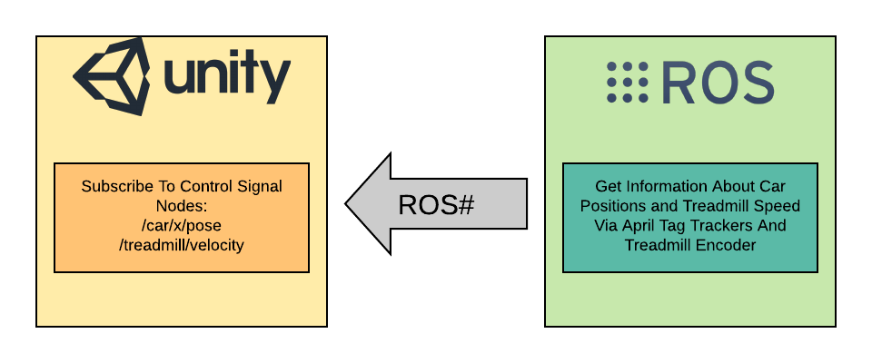

# ADAS-car-on-treadmill-visualizer
Visualization tool designed for the ADAS-on-a-treadmill system used by the University of Waterloo Real-time Embedded Systems Lab.  The visualizer is built into Unity Game Engine and subscribes to ROS topics such as the treadmill speed and car positions using a library called [ROS Sharp](https://github.com/siemens/ros-sharp).  



## Unity Installation Instructions
### Windows/Mac:
1. Install [Unity](https://unity3d.com/get-unity/download/archive).  The visualizer was built using version 2018.2.18, but should work with later versions.
### Linux:
1. Install the Download Helper from the last page of the [Unity-on-Linux release thread](https://forum.unity.com/threads/unity-on-linux-release-notes-and-known-issues.350256/).  At this time the latest release is [2018.3.0f2](https://beta.unity3d.com/download/6e9a27477296/UnitySetup-2018.3.0f2).
2. Install the prerequisites via: 
```
sudo apt install libgtk2.0-0 libsoup2.4-1 libarchive13 libpng16-16 libgconf-2-4 lib32stdc++6 libcanberra-gtk-module
```
3. Run the installer: 
```
~/Downloads/UnitySetup-2018.3.0f2
```
4. Place Unity in the `/opt` folder so it can be run from the command line (Optional)
```
sudo mv Unity-2018.3.0f2 /opt/Unity3D
sudo ln -s /opt/Unity3D/Editor/Unity /usr/bin/unity3d
```

## Steps to Run the Visualizer: 
1. Open the project folder "visualization" in Unity 
2. Once the ADAS-on-a-treadmill system is running, run the [rosbridge server](http://wiki.ros.org/rosbridge_suite/Tutorials/RunningRosbridge) in a separate terminal:
```
roslaunch rosbridge_server rosbridge_websocket.launch
```
3. Open the scene "Visualization Environment" in Unity and click play. 


